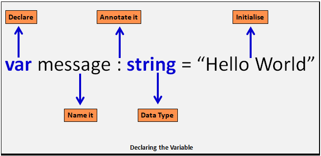

### 변수 선언

### Declare
* 선언자
    - 변수 앞에 위치하는 키워드
    - 선언자에 따라서 변수의 scope가 달라진다.
* scope level
    - 함수 level  : 선언자가 함수 level일 경우 해당 변수는 함수 안에 개별 선언으로 인식 된다.
    - 블록 level  : 선언자가 블록 level일 경우 해당 변수는 블록 안에 개별 선언으로 인식 된다.
    - 전역 level  : 선언자가 전역 level일 경우 해당 변수는 프로그램 모든 범위에서 개별 선언으로 인식 된다.
* scope의 운선 순위
    - 블록 level > 함수 level > 전역 level

1. var
    1. 호이스팅 이된다. (호이스팅 : 변수를 나중에 선언해도 실행시 해당 선언을 코드 최상단으로 올리는 것을 말한다)
1. let
    1. 같은 블록 내에서 같은 이름의 변수를 중복해서 선언 할 수 없다.
    1. 변수를 초기화 하기 전에는 변수에 접근 할 수 없게 해서 호이스팅을 방지한다.
    1. 선언할 변수에 블록 레벨 스코프를 적용한다.
1. const
    1. 선언과 변수 초기화를 동시애 해야 한다.
    1. 변수 초기화 후에는 값을 변경 할 수 없다.

