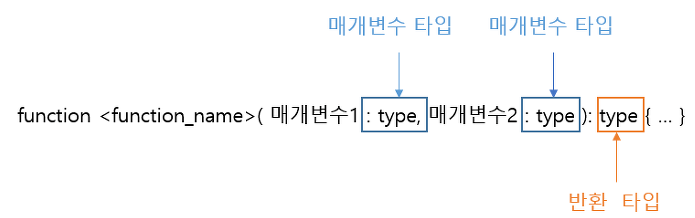

### 함수 선언


### 1. 선언적 함수
기본 함수
``` typescript
function profile(name: string) {
    console.log(name);
}
profile("doitnowm-man");
```
매개변수 초기값 명시
``` typescript
function profile(name: string, age: number = 32) {
    console.log(name, age);
}

profile("doitnowm-man");
```
선택 매개 변수
``` typescript
function secretProfile(name: string, age?: number) {
    return name + age;
}

console.log(secretProfile("doitnow-man ")); // 결과 : doitnow-man undefined
console.log(secretProfile("doitnow-man ", 32)); // 결과 : doitnow-man 32
```
### 2. 익명 함수
``` typescript
const testFunc = x => { return x; };
const testFunc: number = (x: number) => { return x; };
const testFunc = (x: number): number => { return x; };

console.log(testFunc(12));

```
``` typescript
type funcType = (x: number) => number;
let typfunc: funcType = (x: number) => { return x; };

console.log(typfunc(10)); // 결과 10
```
``` typescript
let iif = ((x:number) => { return x;})(3)

console.log(iif); // 결과 3
```
### 3. 콜백 함수
``` typescript
// 익명 callback 함수 타입, callback 함수의 가독성을 위해서 사용 합니다
type callBackType = (mesasge: string) => void ;

// 익명 콜백 함수
let crazy: callBackType = meessage => { return "cray!!!"; };

// 익명 콜백 함수
let sad: callBackType = meessage => { return "sad"; };

// 콜백 함수를 실행 할 함수
function callfunc(message: string, callback: callBackType) {
    return "I am " + callback(message);
}

// cray 콜백 함수를 인자로 주어 함수 실행
let result1 = callfunc("hello", crazy);
console.log(result1);

// sad 콜백 함수를 인자로 주어 함수 실행
let result2 = callfunc("hello", sad);
console.log(result2);
```
